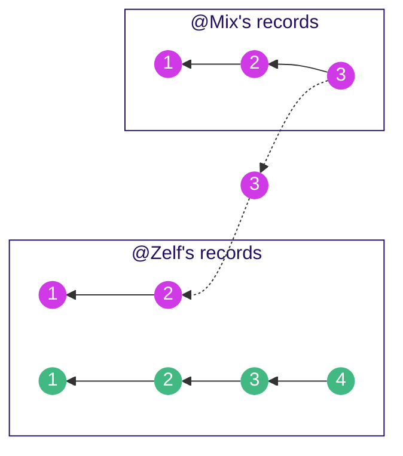

# Scuttlebutt Treasure Map for Developers

Welcome traveller! **Secure Scuttlebutt (SSB)** is a project which spans several communities and technologies.
This documentation is a meta-guide designed to familiarise you with some core concepts,
and help you find the current tools in you language of choice.

More information:
* If you are looking for an **implementation-agnostic** protocol specification, see the [Scuttlebutt Protocol Guide](https://ssbc.github.io/scuttlebutt-protocol-guide/) site
* If you want to learn more about Scuttlebutt in general (such as talks and how to get started), go visit the [main site](https://ssb.nz).

## Implementations

Jump straight in?

Language               | In production
-----------------------|:---:
[Node.js](javascript/) | ✓ 
[Go](golang/)          | ✓
[Rust](rust/)          | ?
[Python](python/)      | ?

## Learn some core ideas

The reference implementation of scuttlebutt was built in Node.js, and to date this languages ecosystem is the mostly developed,
but it also uses the most experimental / homegrown technologies.

All implementations reference some common concepts:

### Feeds

Data in scuttlebutt is held in feeds. Each peer in the network holds it's own feed of messages it has written, along with the feeds of peers that it cares about.

_Diagram showing a chain of messages all belonging to a particular feed. Each references the message before it in the feed by its unique ID (the hash of the message)._

- A **Feed** is an linked list of messages which are all signed by a particular set of keys.
- **Messages** are signed payloads that link to the _previous_ message (like a Git commit).
- **Keys** are Ed25519 keypairs used for signing and encryption (like a PGP key).

This construction makes it easy to verify messages (we check the signature on the message matches the author),
as well as to ask other peers for the latest updates (e.g. "can I have any messages after message 4 for @Zelf").

### Replication

Replication is about sharing updates (messages added to feeds) with other peers.

_Diagram showing @Zelf who holds her own feed (green) and 2 messages of @mix's feed (fuschia), and her replicating the latest message (3) from Mix_

In Scuttlebutt this is done through
- **Multiserver address** [usually] a combined address and public key (like HTTPS with certificate pinning).
- **Secret Handshake (SHS)** - an authenticated key exchange protocol (like TLS).
- **MuxRPC** - a communication protocol (like HTTP).

### Protocol Guide

You can read about this in depth in the [Scuttlebutt Protocol Guide](https://ssbc.github.io/scuttlebutt-protocol-guide/#keys-and-identities).

If you'd like an erotic representation of the Secret Handshake Protocol, you can see that <a href="assets/handshake-erotica.png">here</a> O.o

